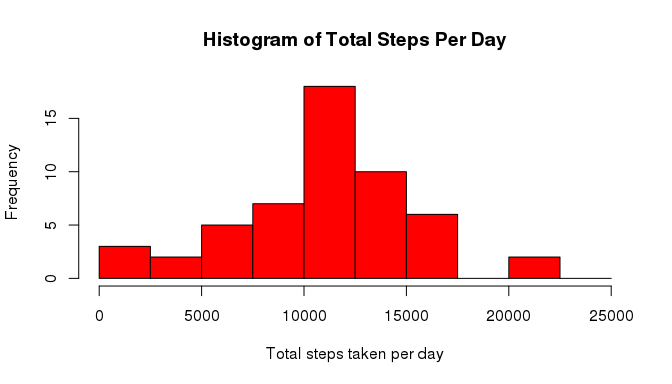
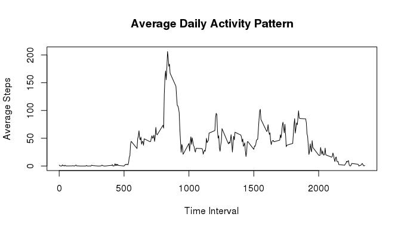
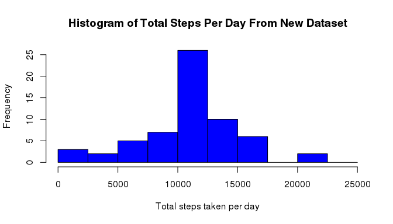
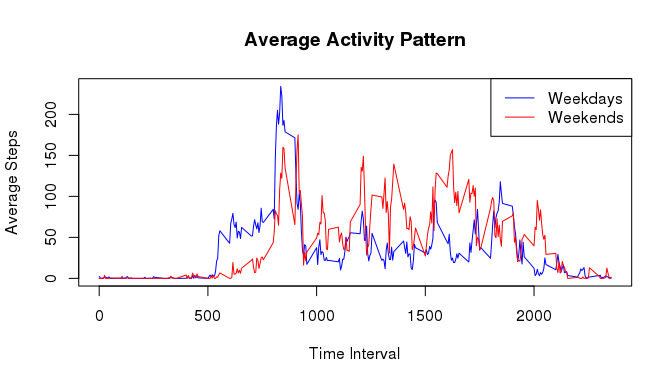

# Reproducible Research: Peer Assessment 1

<<<<<<< HEAD
This document will include several **R code chunks** to load data and do some analyses. 

The data consists of two months of data from an anonymous individual collected during the monts of October and November, 2012 and include the number of steps taken in 5 minute intervals each day.  


## Loading and preprocessing the data

Load (i.e. `read.csv()`) and show the summary of the data before we process it.


```r
oridata <- read.csv("./data/activity.csv", sep = ",", header = TRUE, 
                    colClasses = c('numeric', "Date", "integer"))
summary(oridata)
```

```
##      steps             date               interval     
##  Min.   :  0.00   Min.   :2012-10-01   Min.   :   0.0  
##  1st Qu.:  0.00   1st Qu.:2012-10-16   1st Qu.: 588.8  
##  Median :  0.00   Median :2012-10-31   Median :1177.5  
##  Mean   : 37.38   Mean   :2012-10-31   Mean   :1177.5  
##  3rd Qu.: 12.00   3rd Qu.:2012-11-15   3rd Qu.:1766.2  
##  Max.   :806.00   Max.   :2012-11-30   Max.   :2355.0  
##  NA's   :2304
```

From the summary, the maximum 5-minute time interval is 2355. But total minutes in a day will be 24 hours x 60 minutes/hour = 1440 minutes. So we need to look at the data closely.

Let's show the data from row 10 to 15.


```r
oridata[10:15,]
```

```
##    steps       date interval
## 10    NA 2012-10-01       45
## 11    NA 2012-10-01       50
## 12    NA 2012-10-01       55
## 13    NA 2012-10-01      100
## 14    NA 2012-10-01      105
## 15    NA 2012-10-01      110
```


We see that the time interval changes from 55 to 100. Apparently, the time interval is in the formate of **hours:minutes**. Thus, 55 as 00:55, 100 as 01:00, and 2355 as 23:55.

## What is mean of total number of steps taken per day?

First, we make the histogram of total steps taken per day.


```r
totalstepsdaily <- aggregate(steps ~ date, data = oridata, FUN = sum, na.rm = TRUE)

hist(totalstepsdaily$steps,
     breaks = seq(0, 25000, by = 2500),
     main = "Histogram of Total Steps Per Day",
     xlab = "Total steps taken per day",
     col = "red")
```

 

We calculate the **mean** and **median** total number of steps taken per day.


```r
meansteps <- mean(totalstepsdaily$steps)
mediansteps <- median(totalstepsdaily$steps)
```

The **mean** of total steps taken daily is **1.0766189\times 10^{4}** steps. And the **median** of total steps taken daily is **1.0765\times 10^{4}** steps.

## What is the average daily activity pattern?

Make a time series plot(i.e. `type = "l"`) of the 5-minute interval (x-axis) and the average number of steps taken, averaged across all days (y-axis)


```r
## Calculate the mean of total steps taken by time intervals
meanbyInterval <- aggregate(steps ~ interval, data = oridata, FUN = mean, na.rm = TRUE)

plot(meanbyInterval$interval,
     meanbyInterval$steps,
     type = "l",
     main = "Average Daily Activity Pattern",
     xlab = "Time Interval",
     ylab = "Average Steps")
```

 

Which 5-minute interval, on average across all the days in the dataset, contains the maximum number of steps?


```r
maxdaily <- meanbyInterval[meanbyInterval$steps == max(meanbyInterval$steps),]$interval
```

The 5-minute interval, **835**, contains the maximum steps daily; i.e. this person is most active at **08:35** during a day.

## Imputing missing values

Calculate and report the total number of missing values in the dataset (i.e. the total number of rows with `NA`s)


```r
sum(is.na(oridata$steps))
```

```
## [1] 2304
```

Devise a strategy for filling in all of the missing values in the dataset. The strategy does not need to be sophisticated. For example, you could use the mean/median for that day, or the mean for that 5-minute interval, etc.


```r
## Subset the rows with steps == NA
isNA <- oridata[is.na(oridata$steps),]

## Subset the rows of valid steps value
notNA <- oridata[!is.na(oridata$steps),]

## Drop the "NA" column, and then fill in the mean of steps by time intervals
isNA <- subset(isNA, select = - steps)
fillNA <- merge(isNA, meanbyInterval, by = "interval")
```

Create a new dataset that is equal to the original dataset but with the missing data filled in.


```r
newdata <- rbind(notNA, fillNA)
newdata <- newdata[order(newdata$date, newdata$interval),]
rownames(newdata) <- rownames(oridata)
```

Now let's see the top 6 rows of the original dataset and the new dataset


```r
head(oridata)
```

```
##   steps       date interval
## 1    NA 2012-10-01        0
## 2    NA 2012-10-01        5
## 3    NA 2012-10-01       10
## 4    NA 2012-10-01       15
## 5    NA 2012-10-01       20
## 6    NA 2012-10-01       25
```

```r
head(newdata)
```

```
##       steps       date interval
## 1 1.7169811 2012-10-01        0
## 2 0.3396226 2012-10-01        5
## 3 0.1320755 2012-10-01       10
## 4 0.1509434 2012-10-01       15
## 5 0.0754717 2012-10-01       20
## 6 2.0943396 2012-10-01       25
```


Make a histogram of the total number of steps taken each day and Calculate and report the **mean** and **median** total number of steps taken per day. Do these values differ from the estimates from the first part of the assignment? What is the impact of imputing missing data on the estimates of the total daily number of steps?


```r
newtotaldaily <- aggregate(steps ~ date, data = newdata, FUN = sum, na.rm = TRUE)
hist(newtotaldaily$steps,
     breaks = seq(0, 25000, by = 2500),
     main = "Histogram of Total Steps Per Day From New Dataset",
     xlab = "Total steps taken per day",
     col = "blue")
```

 


```r
newmean <- mean(newtotaldaily$steps)
newmedian <- median(newtotaldaily$steps)
```

The **mean** of total steps daily from the new dataset is 1.0766189\times 10^{4}.
The **median** of total steps daily from the new dataset is 1.0766189\times 10^{4}.


```r
newmean - newmedian
```

```
## [1] 0
```

After imputing the missing values with the mean of total steps taken for the 5-minute time intervals, the median is equal to the mean.

## Are there differences in activity patterns between weekdays and weekends?

Let's plot the activity patterns of weekdays and weekends


```r
oridata$weekdays <- lapply(oridata$date, function(date) date <- weekdays(date, abbreviate = TRUE))
weekend <- oridata[oridata$weekdays %in% c("Sat", "Sun"),]
weekday <- oridata[oridata$weekdays %in% c("Mon", "Tue", "Wed", "Thu", "Fri"),]

weekendPattern <- aggregate(steps ~ interval, data = weekend, FUN = mean, na.rm = TRUE)
weekdayPattern <- aggregate(steps ~ interval, data = weekday, FUN = mean, na.rm = TRUE)

plot(weekdayPattern$interval,
     weekdayPattern$steps,
     type = "l",
     col = "blue",
     main = "Average Activity Pattern",
     xlab = "Time Interval",
     ylab = "Average Steps")

lines(weekendPattern$interval,
      weekendPattern$steps,
      col = "red")

legend("topright",
       lty = 1, 
       col = c("blue", "red"),
       legend = c("Weekdays", "Weekends"))
```

 

We can see that this person is more active from 10:00 to 19:00 during weekends.
=======

## Loading and preprocessing the data


## What is mean total number of steps taken per day?


## What is the average daily activity pattern?


## Imputing missing values


## Are there differences in activity patterns between weekdays and weekends?
>>>>>>> 80edf39c3bb508fee88e3394542f967dd3fd3270
